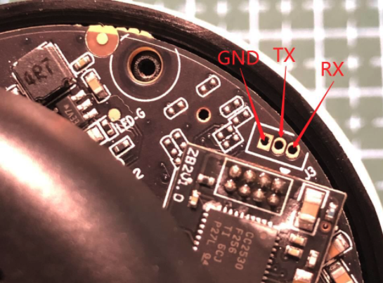

# 相关资源
### 蓝奏云
链接：https://jasonxy.lanzous.com/b015dy82j
密码:53r2
### 百度云：
链接： 
提取码：37s2 
### 腾讯微云
链接：
密码：7h47ib
### minihttp源码地址
[minihttp](https://github.com/chertov/hi_minihttp.git)
### 针对ipc场景的各个soc的sdk下载地址
[soc-sdks](https://dl.openipc.org/SDK/)
 
# 硬件
## chips
- **CPU:** Hi3518EV200
- **WIFI:** RTL8188ETV
- **ZIGBEE:** CC2530 + 2401C射频前端
- **SENSOR:** OV9732

## pins
- 摄像头正面红绿双色指示灯  

LED_G|L1 | GPIO8_0 |
--- | --- | ----
LED_R | F2 | GPIO7_4

- 红外灯

| IR_EN|K2 | SAR_ADC_CH1/GPIO7_7 |
--- | --- | ----

- 灯板7P排针

| pin1|RS1 | -引脚  | K1 | SAR_ADC_CH0/GPIO7_6 | 红外接收 |
--- | --- | ---- | --- | ---| ---
| pin2|RS1 | +引脚  | 3.3V | 电源 |  |
| pin3|双色LED公共端 | |  |  |  |
| pin4|LED_G | |  |  |  |
| pin5|LED_R | |  |  |  |
| pin6|IR_LED- | |  |  |  |
| pin7|IR_LED+ | |  |  |  |

- IR_CUT

红线 | 接LDO | 2.8V |
--- | ---| ---
黑线 | AE1511 | 4脚 |
 | AE1511 | 3脚 | J1 | GPIO0_1


- ZIGBEE排针

| pin1 | | VCC | | |
---|---|---|---|---
| pin2 | nc | | CC2530 | P2_2
| pin3 |  |GND | | |
| pin4 |  | GND| | |
| pin5 | d14 |  UART1_RXD | CC2530 | P0_3| 
| pin6 | nc | | CC2530 | P2_1
| pin7 | e14 | UART1_TXD | CC2530 | P0_2
| pin8 | f1 | GPIO7_5 | CC2530_RST | | 

- 按键

| KEY|N3 | GPIO0_2 |
--- | --- | ----

## UART接口定义


# 软件
## PC串口工具

平台 | 工具
---|---
linux | minicom
Mac | screen/minicom
Windows | [putty](https://www.chiark.greenend.org.uk/~sgtatham/putty/latest.html) 

## 串口设置
- **波特率**： 115200
- **bits**： 8
- **奇偶校验**： none
- **停止位**： 1
- **流控**： none


## 刷固件
1. 下载固件包[firmware-20200420.tar.gz](https://github.com/felix-001/hackboyun/raw/master/firmware/firmware-20200420.tar.gz)
2. sd卡格式化为`fat32`
3. 解压，拷贝到sd卡根目录
  ```
  tar zxvf firmware-20200420.tar.gz
  ```
4. sd卡插到摄像头,上电时按回车键中断进入uboot
5. 烧写uboot
  ```
  sf probe 0
  sf lock 0
  fatload mmc 0 0x82000000 u-boot.20200419.bin
  sf erase 0x0 0x80000
  sf write 0x82000000 0x0 $(filesize)
  reset
  ```
6. reset后,等待新uboot启动,并自动烧写`kernel`和`rootfs`
7. 烧写完毕后需要拔下sd卡，以免下次上电再次烧写

- [Lexsion的罗嗦版刷固件教程](./doc/Boyun_FlashFirmware.md)

### uboot被破坏的解决办法
- 使用`hitool`烧写uboot，详细使用手册见[hitool使用手册](./doc/tools)
- 参考[博云救砖教程](./doc/tools/博云救砖教程.docx)

## 配网
- 设置ssid和passwd
```
vi /etc/config/wireless
```
将`OpenWrt`和`1234567890`替换成自己的
- 联网
```
wifi
```

## 访问openwrt页面
浏览器访问`http://your-camera-ip`

## 查看摄像头实时流
- 通过mjpeg的方式  
浏览器访问`http://your-camera-ip:8080/mjpeg`
- 通过rtsp的方式
  - 电脑或手机安装vlc
  - 启动vlc，选择open network...
  - 输入如下地址：`rtsp://your-camera-ip:554/test.h264`
- 通过mp4的方式  
浏览器访问`http://your-camera-ip:8080/video.mp4`
- 配置文件设置  
调整线程栈大小,将栈的大小从`16348`设置为`163840`
```
vi /etc/minihttp.ini
```
将`isp_thread_stack_size`,`venc_stream_thread_stack_size`, `web_server_thread_stack_size`改为:**163840**

**注意:不改配置文件,可能播放流一段时间会卡死**


# 开发

## 开发环境搭建
- 下载交叉编译工具链`arm-openwrt-linux-gcc.tar.gz`,并安装
```
tar zxvf arm-openwrt-linux-gcc.tar.gz -C /opt
```
- 设置环境变量
```
echo "export PATH=$PATH:/opt/arm-openwrt-linux-gcc/bin" >> ~/.bashrc
source ~/.bashrc
```

## 编译
```
mkdir build
cd build
cmake ..
make
```

目前kernel没有使能NFS，但是fs带了`curl`， 目前比较快的调试办法是PC搭一个http server，程序编译好后，使用curl去下载可执行文件
- curl下载
```
curl http://your-pc-ip:/your-exe > your-exe
```
- 快速搭建http server
```
python -m SimpleHTTPServer 
```
## FTP
摄像头开启ftp:
```
tcpsvd -vE 0.0.0.0 21 ftpd /your/ftp/path
```
用户名:`root` 密码: none

## 文档  
- [OV9732](./doc/sensor)
- [CC2530](./doc/zigbee)
- [救砖教程](./doc/tools/博云救砖教程.docx)

## 控制灯
/sys/devices/dev:gpio7/gpio/gpio62

## ADC
adc相关操作写成了shell脚本:`scripts/adc.sh`

## GPIO
gpio相关操作:`scripts/gpio.sh`

## PWM
pwm相关操作: `scripts/pwm.sh`

## WATCHDOG
关闭看门狗： `scripts/close_watchdog.sh`
